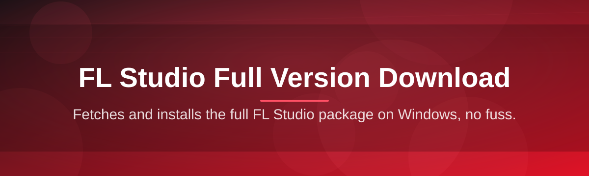
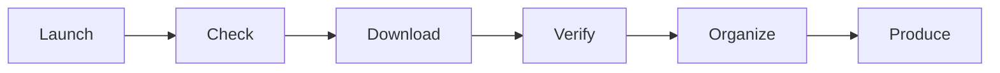

# fl-studio-suite-manager 🎛️🚀

  

*One manager, one download page, zero headaches — the sane way to organize your FL Studio full version download and keep your production rig tidy.*

## 🎧 Overview

Let's be honest: the "FL Studio full version download" search results page is a minefield. Sketchy mirrors, ten redirects deep, mismatched build numbers, and installers that fight your antivirus for sport. **fl-studio-suite-manager** exists because producers shouldn't need a forensics degree just to get their DAW set up and start making noise. This project is a lightweight, standalone Windows companion that centralizes the download, verification, and organization workflow around FL Studio releases — so you spend your time in the piano roll, not in your Downloads folder sorting `setup(3)final_REAL.exe`.

This isn't a mirror, a loader, or some shady repackaging of installers. It's a **suite manager** — think of it as the mission control panel that sits next to your actual FL Studio installation. It points you to the official landing page for grabbing the current build, tracks version metadata, checks file integrity, manages your plugin and preset folders, and keeps a clean audit trail of what's installed and when. It exists for the same reason a good pedalboard exists for a guitarist: not to replace the instrument, but to keep everything plugged in correctly.

Who's this for? Bedroom producers who just reinstalled Windows for the fifth time this year. Studio techs managing multiple production workstations. Educators setting up lab machines for a music tech class. Anyone tired of the full version download experience feeling like a treasure hunt with cursed loot. If that's you, welcome — pull up a chair, the mixer's warm.

> [!NOTE]
> fl-studio-suite-manager is a management and organization layer. It directs you to the official project landing page for the actual FL Studio full version download — we don't host, mirror, or modify installers ourselves.

  

---

## ⚡ What This Thing Actually Does

  

**Version Radar** — keeps tabs on the current FL Studio release cycle so you're never installing a build three generations behind everyone else in your Discord server.

**One-Click Landing Redirect** — the download button up top (and down below) sends you straight to the canonical project page. No pop-up ads, no "click here 5 times to continue" nonsense.

**Integrity Fingerprinting** — after you grab the installer, the manager checksums it against known-good hashes so you know the file wasn't mangled in transit or swapped by a dodgy mirror.

**Plugin Vault Organizer** — scans your VST/VST3 folders and builds a tidy inventory, so you know exactly what's loaded before you even open the DAW.

**Preset & Project Housekeeping** — auto-sorts `.flp` projects, sample packs, and preset banks into a predictable folder structure instead of the chaotic pile most of us actually have.

**Lightweight Launch Dashboard** — a single-window control center showing install status, disk footprint, and last-checked version — no background bloat eating your RAM while you mix.

**Offline-Friendly Mode** — once you've downloaded and verified everything, the manager works fully offline. No phoning home every five minutes.

**Portable Config Profiles** — export your setup as a small config file and rebuild the same environment on a new machine in minutes.

> [!TIP]
> Run the integrity check *before* your first launch of a freshly downloaded installer. It takes fifteen seconds and it's saved more than one producer from installing a corrupted build the night before a deadline.

---

## 🚀 How to Get Started

1. **Visit the landing page** using the download button above — that's the only place this project points you toward for the actual FL Studio full version download.

2. **Grab the installer** for the current release. The page lists the build number and file size so you know what you're getting before you click.

3. **Run fl-studio-suite-manager** alongside it — launch the `.exe`, let it detect your install directory (or point it manually), and let the dashboard populate.

4. **Verify, organize, produce.** Run the integrity check, let it sort your plugin/preset folders, and you're off to make something that actually sounds good.

> [!IMPORTANT]
> Always download from the official landing page linked in this README. Third-party mirrors claiming to offer the "same" FL Studio full version download are exactly the mess this project was built to help you avoid.

---

## 🖥️ System Requirements

| Component | Minimum | Recommended |
|---|---|---|
| OS | Windows 10 (64-bit) | Windows 11 (64-bit) |
| RAM | 4 GB | 8 GB+ |
| Disk Space | 2 GB free | 5 GB+ (for samples/plugins) |
| Dependencies | None — fully standalone | None |
| Admin Rights | Not required for the manager | Required only for FL Studio install itself |

> No hidden dependencies, no background services, no telemetry-heavy runtime. It's just an `.exe` that respects your CPU cycles.

---

## 🧩 How It Works

The whole flow is intentionally boring — boring is reliable, and reliable is what you want at 2 AM when a track is due tomorrow.

1. You launch **fl-studio-suite-manager**.
2. It checks the landing page for the current release metadata.
3. You click through to download the actual FL Studio full version installer.
4. The manager verifies the file and organizes your install environment.
5. You launch FL Studio and get back to making music.

---

## 🛟 Troubleshooting

**Q: The download button redirects me but the page looks different from last time — is that normal?**
A: Yes. The landing page gets refreshed periodically to reflect the current FL Studio release cycle. Layout changes don't mean anything's wrong.

**Q: My antivirus flagged the installer after I downloaded it from the official page.**
A: Run the integrity checksum built into fl-studio-suite-manager first. If the hash matches the published one, it's almost always a false positive from an overzealous heuristic scanner — common with large installer packages.

**Q: The manager says "install directory not detected" — what now?**
A: Point it manually to your FL Studio folder (usually under `Program Files`). Some custom install paths aren't auto-detected on first run.

**Q: Can I use this manager for older FL Studio versions too?**
A: Version Radar is tuned for current releases, but the organizer and integrity tools work fine on legacy installs as well.

**Q: Does this modify my FL Studio installer or license activation?**
A: No. This project never touches installer contents or licensing mechanisms — it manages files, folders, and metadata around your setup, nothing more.

**Q: My plugin scan shows duplicates — why?**
A: Usually because a plugin is installed in both the 64-bit and legacy 32-bit VST directories. The organizer flags these so you can clean house.

---

## 🎨 UI / UX Details

<strong>Keyboard shortcuts</strong>

| Shortcut | Action |
|---|---|
| `Ctrl + D` | Open download landing page |
| `Ctrl + R` | Refresh version check |
| `Ctrl + I` | Run integrity verification |
| `Ctrl + Shift + O` | Open plugin/preset organizer |
| `F5` | Rescan install directory |
| `Esc` | Close active dialog |

<strong>Themes & appearance</strong>

- Dark Studio (default) — low-glare, built for long night sessions
- Light Console — for daytime setup and studio classroom use
- High Contrast — accessibility-focused palette

> [!TIP]
> Settings → General lets you pin a default install directory so the manager never asks twice.

---

## 🤝 Contributing & Community

This project grew because producers kept asking "why isn't there just a clean way to do this?" — so we built one, and now thousands of people use it. Contributions are genuinely welcome, whether that's:

- Reporting bugs via Issues (please include your Windows build and manager version)

- Suggesting UX improvements — the dashboard is opinionated but not finished

- Submitting pull requests for the organizer engine or checksum logic

- Helping other users in Discussions — the community answers questions faster than most support tickets ever will

> [!WARNING]
> Please don't open issues asking for links to alternative installer sources. This project only ever points to the official landing page, and requests otherwise will be closed.

---

## 📜 License

Licensed under the [MIT License](LICENSE), 2026. Use it, fork it, remix it — just keep the license notice intact.

---

## ⚠️ Disclaimer

fl-studio-suite-manager is an independent, community-built organizational tool. It is not affiliated with, endorsed by, or officially connected to Image-Line or the FL Studio brand. All trademarks belong to their respective owners. This tool manages files and workflow around your own legitimately obtained software — it does not distribute, modify, or unlock any licensed product.

  

